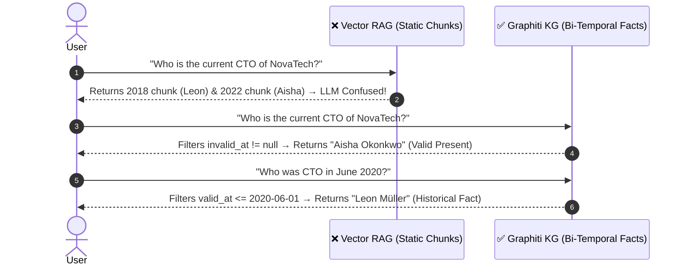
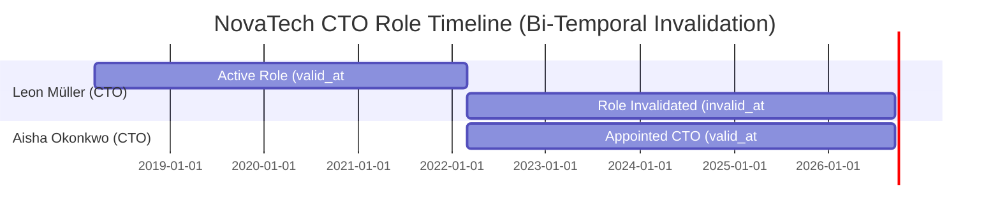
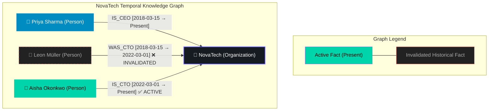
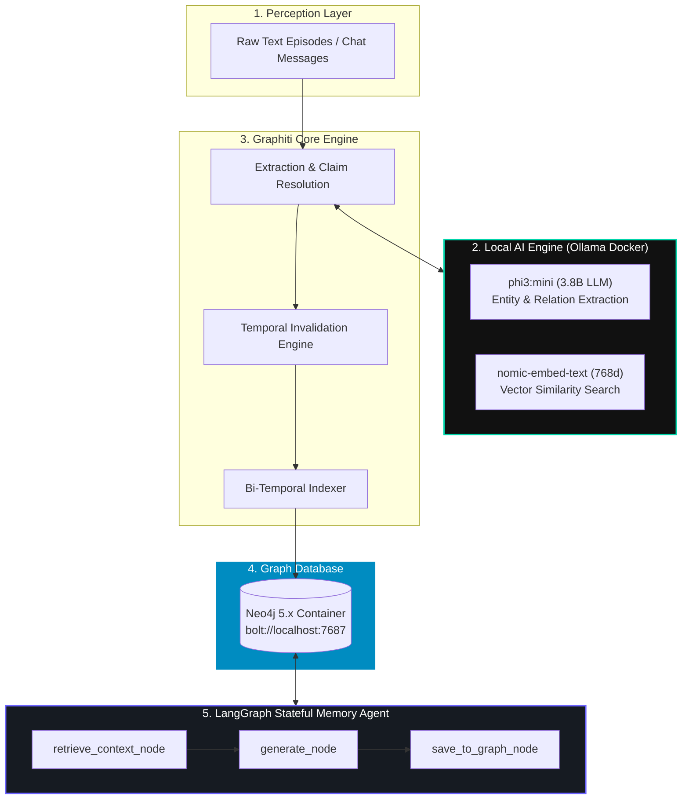
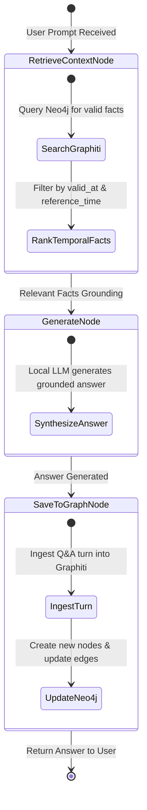

<div align="center">


<br/>


<br/>

```text
  ┌────────────────────────────────────────────────────────────────────────┐
  │   🧠 TEMPORAL KNOWLEDGE GRAPH FOR AI AGENTS (CONTEXT | PERCEPTION | MEMORY)  │
  └────────────────────────────────────────────────────────────────────────┘
```

</div>

---

## ⚡ Visual Overview — How Graphiti Solves Agent Amnesia

### 1. Vector RAG vs. Graphiti Temporal KG



---

### 2. Bi-Temporal Fact Lifecycle & Automatic Invalidation



---

### 3. Visual Knowledge Graph State



---

## 🏗️ System Architecture (100% Local Zero-Cost Stack)



---

## ⚡ LangGraph Memory Agent Loop



---

## 🚀 Quick Start (Zero-Cost Setup)

### 1. Launch Containers & Pull Local AI Models
```bash
# Start Neo4j & Ollama containers
docker compose up -d

# Download open-source models (phi3:mini LLM + nomic-embed-text embedder)
bash setup_models.sh
```

### 2. Set Up Python Environment
```bash
python3 -m venv venv
source venv/bin/activate
pip install -r requirements.txt
```

---

## 🧪 Tasks & Execution Guide

### Task 1 — Build Knowledge Graph
```bash
python 1_ingest_graph.py
```
> Extracts entities, temporal relations, and invalidation rules directly into Neo4j.

### Task 2 — Temporal Graph Queries
```bash
python 2_query_graph.py
```
> Demonstrates historical point-in-time search vs. present active state search.

### Task 3 — Stateful LangGraph Agent
```bash
python 3_langgraph_agent.py
```
> Agent automatically retrieves temporal graph context before generating responses and saves cross-session memory.

---

## 📊 Graphiti (Local Open Source) vs. Zep Cloud

| Parameter | 🏠 Self-Hosted Graphiti | ☁️ Zep Cloud |
|---|---|---|
| **Deployment** | Local Docker (Neo4j + Ollama) | Managed Serverless Cloud API |
| **API Cost** | **$0.00 (100% Free)** | Paid Tier / Consumption-based |
| **Data Privacy** | Air-gapped / Complete local isolation | SOC2 Compliant Cloud Storage |
| **Latency** | Dependent on CPU/GPU hardware | Optimized < 200ms Cloud SLA |
| **Setup Time** | ~2 minutes (`docker compose up`) | Instant API Key generation |
| **Infrastructure Control**| Full access to Cypher & Graph schemas | Managed abstract API endpoints |

---

## 🔍 Neo4j Visual Explorer

Inspect your generated graph directly in your browser:
- **URL:** [http://localhost:7474](http://localhost:7474)
- **Login:** `neo4j` / `graphiti123`

```cypher
MATCH (n)-[r]->(m) RETURN n, r, m LIMIT 50;
```
