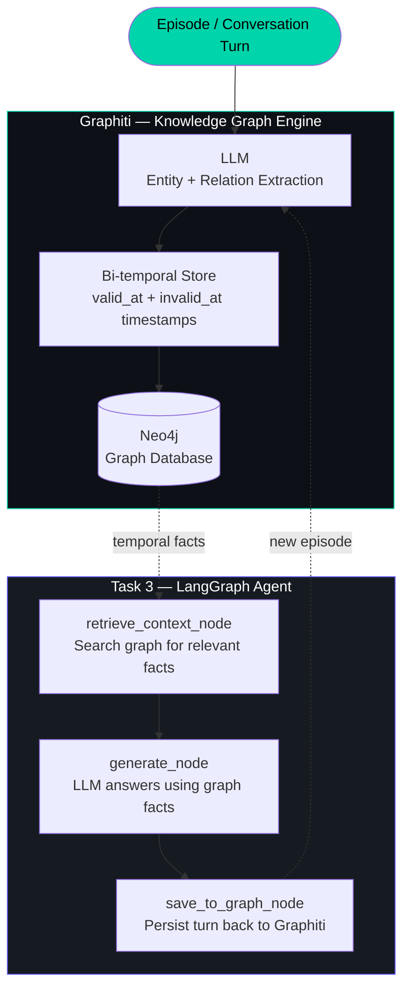

<div align="center">


<br/>


**Temporal knowledge graphs for AI agents — context, perception, and decision at real-time speed.**

</div>

---

## What is Graphiti (by Zep)?

Graphiti is an open-source framework for building **temporal knowledge graphs** — called *Context Graphs* — for AI agents.

| | Traditional RAG | Graphiti |
|---|---|---|
| Stores | Text chunks (static) | Facts with timestamps (dynamic) |
| Retrieval | "Find similar text" | "Find relevant facts — current or historical" |
| Memory | None across sessions | Full cross-session persistent memory |
| Updates | Overwrites old data | Temporal invalidation — history preserved |
| Query | Cosine similarity | Entity + relation + time-bounded search |

**Three pillars of Graphiti:**

| Pillar | What it means |
|---|---|
| **Context** | Structured, queryable facts — not raw chunks |
| **Perception** | Real-time, incremental graph updates as new data arrives |
| **Decision** | Temporally-aware retrieval: "What was true then?" vs "What is true now?" |

---

## Architecture



---

## Project Structure

```
graphiti-zep-agent/
│
├── docker-compose.yml           # Neo4j graph database (one command to start)
│
├── utils/
│   └── graphiti_client.py       # Shared Graphiti + Gemini setup
│
├── 1_ingest_graph.py            # Task 1: Feed episodes → build knowledge graph
├── 2_query_graph.py             # Task 2: Temporal queries on the graph
├── 3_langgraph_agent.py         # Task 3: LangGraph agent with Graphiti memory
│
├── requirements.txt
└── .env.example
```

---

## Setup

```bash
# 1. Clone
git clone https://github.com/shivanshinigam/graphiti-zep-agent.git
cd graphiti-zep-agent

# 2. Start Neo4j (graph database) via Docker
docker compose up -d
# Neo4j browser: http://localhost:7474  (login: neo4j / graphiti123)

# 3. Virtual environment + dependencies
python -m venv venv
source venv/bin/activate
pip install -r requirements.txt

# 4. API keys
cp .env.example .env
# Edit .env and add:
#   GEMINI_API_KEY=  (free at https://aistudio.google.com/apikey)
#   ZEP_API_KEY=     (optional — free at https://www.getzep.com)
```

---

## Task 1 — Build the Knowledge Graph

**Goal:** Feed real-world-style episodes about *NovaTech* company into Graphiti and watch it extract entities, relationships, and timestamps automatically.

### Run
```bash
python 1_ingest_graph.py
```

### What Graphiti does with each episode

```
Input (raw text):
  "Leon Müller stepped down as CTO in March 2022.
   Aisha Okonkwo was appointed as the new CTO."

Graphiti extracts:
  Entity  : Leon Müller  (Person)
  Entity  : Aisha Okonkwo  (Person)
  Entity  : NovaTech  (Organisation)

  Relation: Leon --[WAS_CTO_OF]--> NovaTech
              valid_at=2018-03-15, invalid_at=2022-03-01  ← CLOSED fact

  Relation: Aisha --[IS_CTO_OF]--> NovaTech
              valid_at=2022-03-01, invalid_at=None  ← OPEN (still true)

Stored in Neo4j as nodes + timestamped edges.
```

### Episodes ingested

| Episode | Date | Event |
|---------|------|-------|
| ep_001 | March 2018 | NovaTech founded by Priya Sharma (CEO) and Leon Müller (CTO) |
| ep_002 | Jan 2020 | $5M Series A from BlueRock Ventures, Berlin office opened |
| ep_003 | March 2022 | Leon steps down; Aisha Okonkwo becomes CTO |
| ep_004 | Sep 2022 | RouteAI v2.0 launched, led by Aisha |
| ep_005 | Feb 2024 | LogiSense acquired for €8M, 200 employees |
| ep_006 | July 2024 | Priya becomes Chairperson; Marcus Tan promoted to CEO |

---

## Task 2 — Query the Knowledge Graph

**Goal:** Query the graph using temporal anchoring — ask what is true *now* vs what was true *then*.

### Run
```bash
python 2_query_graph.py
```

### Queries and why they demonstrate temporal reasoning

| Query | What it tests |
|-------|--------------|
| "Who is the current CTO?" | Returns Aisha (Leon's fact is invalidated) |
| "Who was CEO in 2020?" | Returns Priya (anchored to June 2020) |
| "What funding has NovaTech received?" | Returns BlueRock + Series A |
| "What companies did NovaTech acquire?" | Returns LogiSense |
| "What has Aisha Okonkwo done?" | Returns CTO role + RouteAI launch |

### Result structure

Each result from Graphiti is an **Edge** (a fact in the graph):
```
Fact       : Aisha Okonkwo is CTO of NovaTech
Valid      : 2022-03-01  →  present
Score      : 0.9241

Fact       : Leon Müller was CTO of NovaTech
Valid      : 2018-03-15  →  2022-03-01    ← invalidated
Score      : 0.4102
```

---

## Task 3 — LangGraph Agent with Graphiti Memory

**Goal:** Wire everything into a stateful LangGraph agent that uses the knowledge graph as its memory layer — retrieving facts before answering, then persisting each conversation turn back into the graph.

### Run
```bash
python 3_langgraph_agent.py "Who is the current CTO of NovaTech?"
python 3_langgraph_agent.py "What happened at NovaTech in 2022?"
python 3_langgraph_agent.py "Who founded NovaTech and what are they doing now?"
```

### Agent pipeline

```
[START]
   |
   v
[retrieve_context_node]    ← search Graphiti, get top-5 temporal facts
   |
   v
[generate_node]            ← LLM (Gemini) answers using facts as grounded context
   |
   v
[save_to_graph_node]       ← persist Q+A turn back into Graphiti
   |
   v
[END]
```

### State schema

```python
class AgentState(TypedDict):
    query         : str          # current question
    graph_context : list[str]    # facts retrieved from Graphiti
    answer        : str          # LLM response
    session_id    : str          # conversation identifier
```

### Why saving back to the graph matters

```
Turn 1: User asks "Who is the CEO?"
        Agent answers: "Marcus Tan (as of July 2024)"
        → saved to graph

Turn 2 (next session): User asks "What did Marcus do as CEO?"
        Agent retrieves facts INCLUDING Turn 1's answer
        → cross-session memory, agent builds on past context
```

---

## Graphiti vs Zep Cloud

| | Self-hosted Graphiti | Zep Cloud |
|---|---|---|
| Setup | Neo4j via Docker + pip | API key only |
| Cost | Free | Free tier + paid plans |
| Latency | Depends on your infra | Sub-200ms guaranteed |
| Scale | Self-managed | Enterprise SLA |
| Code difference | `Graphiti(uri, user, pass)` | `AsyncZep(api_key=key)` |
| Data control | Full | Governed by Zep |
| Best for | Learning / dev / self-hosted prod | Production / enterprise |

---

## Key Concepts

| Concept | Description |
|---------|-------------|
| **Episode** | A raw input (text/JSON/message) fed into Graphiti — the unit of perception |
| **Entity** | A node in the graph — person, organisation, product, concept |
| **Relation (Edge)** | A fact connecting two entities with a validity time window |
| **Bi-temporal model** | Every fact tracks `valid_at` (when true in the world) + `created_at` (when ingested) |
| **Temporal invalidation** | Old facts are *closed* (invalid_at set), not deleted — history is preserved |
| `add_episode()` | Feeds raw text into Graphiti — LLM extracts entities + relations automatically |
| `search()` | Retrieves relevant facts — optionally time-anchored with `reference_time` |
| `reference_time` | Anchors the query to a point in time: "what was true in 2020?" |
